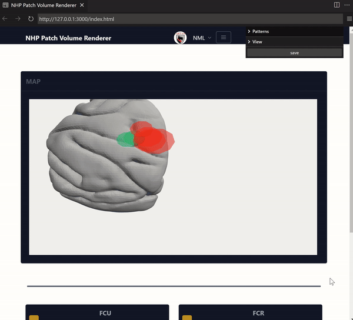

# NHP Patch Online Renderer #
This repository contains Javascripts that render and save color-coded 3D geometries, which are related to simplified patch "active" volumes.   
These shapes facilitate online parameterization of the stimulation interface, in order to produce MEP mappings more intuitively.  

## Example Use ##
  
**Figure 1.** As of _2022-06-23_ this is just a mock-up example to show what kind of interface might be helpful to have for online experiments. The ability to add and adjust volumes related to specific patterns via a manual application interface (or message-passing scheme) has not yet been implemented as I do not know what those messages and relevant parameters are yet.  